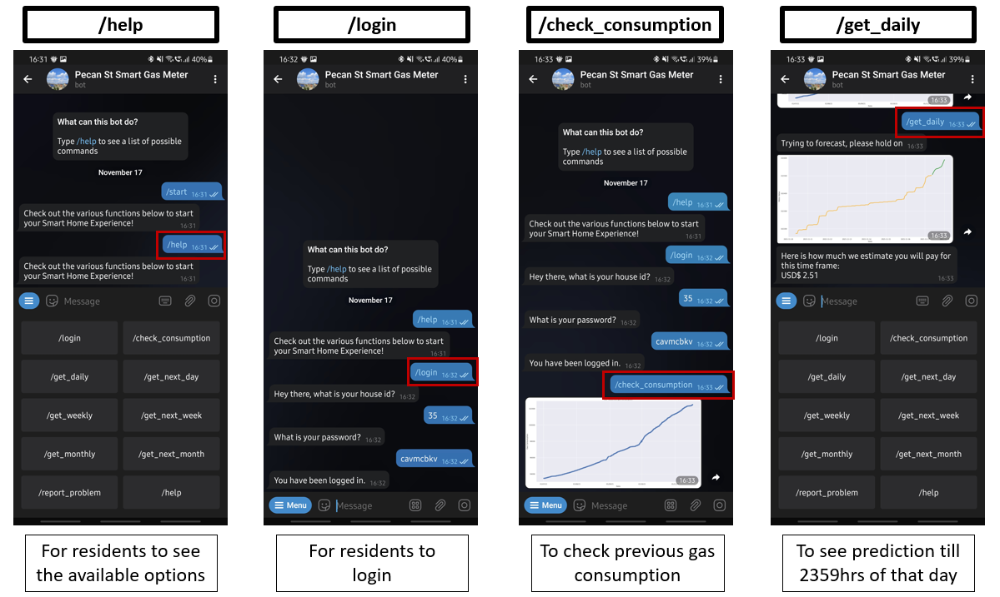
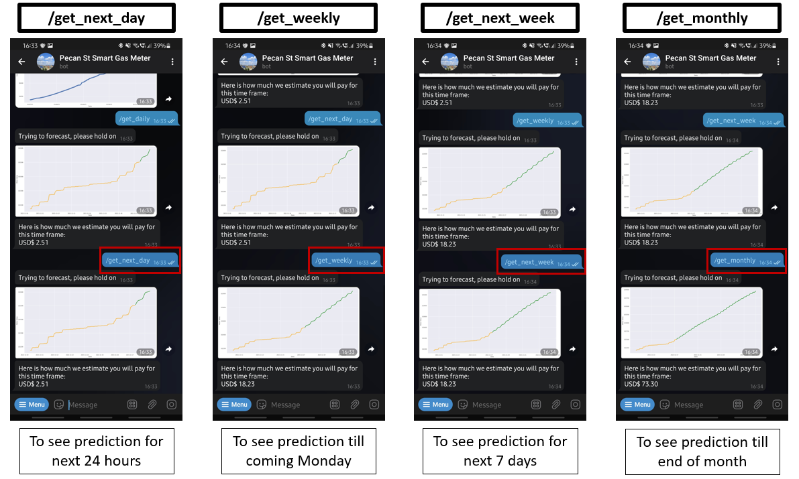

# Day-Ahead-Gas-Consumption-Prediction-Model-And-Telegram-Bot

## Brief Summary
This is a data science project. In this project, a dataset collected by an actual IoT system (see
description below) on smart gas meter readings was given and the task was to use the dataset to build a forecasting model to predict household gas consumption. In total, several forecasting models were built using linear regression, neural networks & LSTM models. In addition, a telegram bot was also built from scratch to provides various services to residents such as sending households their respective gas consumption forecast from the models that were built. The telegram bot was deployed in real-life using Heroku.

This project is split into three parts, namely `Q1_Code`, `Q2_Code` & `Q3_Code` and for more details on each respective part, go to the respective folder and view the jupiter file inside the folder. Code for the telegram bot is located under `Telegram Bot_Code` folder. Some screenshots of the telegram bot can be seen below.

## Details about the provided dataset

The data can be seen by clicking the `dataset.csv` file. In this project, we will consider natural gas consumption data from residential consumers.
The smart gas meter data used for this paper was obtained from the Pecan Street project
(https://www.pecanstreet.org/). The source of the data are homes in the Mueller neighborhood of Austin, Texas, USA. 
The homes in this neighborhood are primarily newly constructed,
and include single-family homes, apartments, and town homes. Itron Centron SR smart gas
meters are deployed in these homes and these meters send their information to a gateway
inside the home. The gateway uses the home’s Internet connection to send the data to the
meter data management system (MDMS) or the processing center. The gas meters measure
the cumulative gas consumption at a frequency of 15 seconds. The meters report a reading
(in terms of the cumulative consumption) when the last marginal 2 cubic foot (or higher) of
natural gas passes through the meter. Data from a six month interval (1 Oct 2015 to 31 Mar
2016) has been provided. The data has the following format:

  `<Timestamp (localtime)> <MeterID (dataid)> <meter reading (meter_value)>`

The timestamp provides the date as well as the the hour and minute values when each reading
was taken. Each meter has an unique identifier (MeterID). Recall that the meter readings
are cumulative and not generated at periodic intervals.

## Requirements
Please ensure that you have downloaded [Jupyter](https://jupyter.org/install)

## Libraries Used
A range of different libraries that are typically used in data science project like this were used. These include TensorFlow, SciPy, NumPy, Pandas, Matplotlib, Keras, Scikit-learn and etc.  

## Part 1 (Code and additional details are inside the `Q1_Code` folder)
In this first part, the first task was to evaluate how many houses were included in the measurement study. Then, the malfunctioning meters had to be identified using our own valid and justifiable criterias and the time periods where they were malfunctioning also had to be evaluated. Then, we had to generate and plot hourly readings from the given raw data. With this evaluated data, for each home, we had to find the top five homes with which it shows
the highest correlation.

## Part 2 (Code and additional details are inside the `Q2_Code` folder)
For this part, we had to build a linear regression and support vector regression models to forecast the hourly readings in the future (next
hour). We had to generate two plots namely time series plot of the actual and predicted hourly
meter readings and scatter plot of actual vs predicted meter readings (along with
the line showing how good the fit is).

## Part 3 (Code and additional details are inside the `Q3_Code` folder)
For this part, we built better models to predict a household's future gas consumption based on that
household's past consumption. We first broke down the problem into two subtasks.

The first subtask was finding a good model that could accurately forecast household gas
consumption. We already had a forecast model that we created in question 2. However, we were
not totally delighted with its accuracy performance. So we came up with two ideas. The first idea
was adding more useful attributes to the dataset with the belief that this would improve the
accuracy of the model. More specifically, we added some weather attributes to the dataset,
created a new linear regression and neural network model. There was not much improvement to
the accuracy. Our second idea was to create a Long Short-Term Memory (LSTM) network model. There was noticeable increase in accuracy. 

The second subtask was to create a tool that can retrieve the gas forecast from our chosen
model and provide this forecast to the respective households. We didn't wanted to simply stop
at building a good forecast model and wanted to take a step further to demonstate what a gas
provider can then do with the gas forecast model that can benefit both the gas provider and the
households. So, we have created a telegram bot from scratch, just for this project, that can
provide various services to residents such as sending households their respective gas
consumption forecast, from our chosen model. Some screenshots of the telegram bot can be seen below.

